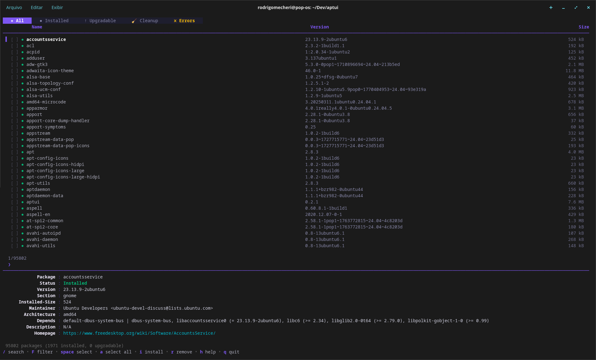

<p align= "center">  </p>

APTUI is a terminal user interface (TUI) written in Go for managing APT packages. Browse, search, install, remove and upgrade packages — all without leaving the terminal.

Built with [Bubble Tea](https://github.com/charmbracelet/bubbletea), [Lip Gloss](https://github.com/charmbracelet/lipgloss) and [Bubbles](https://github.com/charmbracelet/bubbles).

<!-- Screenshots gallery -->
|  |  |
|:--:|:--:|
| Start screen | Transactions |

<!-- Centered animated GIF -->
<p align="center">
	
</p>
<p align="center"><em>Mirror detection and latency testing (animated)</em></p>

## Features

- **Browse all packages** — lists every available APT package with version and size info loaded lazily
- **Fuzzy search** — live fuzzy filtering as you type, with fallback to `apt-cache search`
- **Advanced filter** — powerful query language to filter by section, architecture, size, status and more ([docs](docs/filter.md))
- **Column sorting** — sort packages by name, version, size, section or architecture (ascending/descending)
- **Tabs** — switch between *All*, *Installed* and *Upgradable* views
- **Multi-select** — mark multiple packages with `space`, then bulk install/remove/upgrade
- **Parallel downloads** — installs and upgrades use parallel downloads by default for faster operations
- **Transaction history** — every operation is recorded; undo (`z`) or redo (`x`) past transactions
- **Fetch mirrors** — detect your distro, test mirror latency, and apply the fastest sources
- **Inline detail panel** — shows package metadata (version, size, dependencies, homepage, etc.)

## Installation

### APT (Debian/Ubuntu)

```bash
curl -fsSL https://mexirica.github.io/aptui/public-key.gpg | sudo gpg --dearmor -o /usr/share/keyrings/aptui-archive-keyring.gpg
echo "deb [signed-by=/usr/share/keyrings/aptui-archive-keyring.gpg] https://mexirica.github.io/aptui/ stable main" | sudo tee /etc/apt/sources.list.d/aptui.list
sudo apt update && sudo apt install aptui
```

### Go

```bash
go install github.com/mexirica/aptui@latest
```

### Build from source

```bash
git clone https://github.com/mexirica/aptui.git
cd aptui
go build -o aptui .
sudo mv aptui /usr/local/bin/
```

## Usage

```bash
aptui
```

> Some operations (install, remove, upgrade, apply mirrors) require `sudo`.

## Keybindings

### Navigation

| Key | Action |
|---|---|
| `↑` / `k` | Move up |
| `↓` / `j` | Move down |
| `pgup` / `ctrl+u` | Page up |
| `pgdown` / `ctrl+d` | Page down |
| `tab` | Switch tab (All → Installed → Upgradable) |

### Search & Filter

| Key | Action |
|---|---|
| `/` | Open search bar |
| `F` | Open [advanced filter](docs/filter.md) bar |
| `enter` | Confirm search / apply filter |
| `esc` | Clear search / filter / go back |

#### Filter examples

```
installed size>10MB          # installed packages larger than 10 MB
section:utils order:name     # packages in "utils" section, sorted A→Z
order:size:desc              # all packages sorted by size, largest first
order:size:asc               # all packages sorted by size, smallest first
```

See the full [filter documentation](docs/filter.md) for all available options.

### Selection

| Key | Action |
|---|---|
| `space` | Toggle select current package |
| `A` | Select / deselect all filtered packages |

### Actions

| Key | Action |
|---|---|
| `i` | Install package (or all selected) |
| `r` | Remove package (or all selected) |
| `u` | Upgrade package (or all selected) |
| `G` | Upgrade all packages (`apt-get upgrade`) |
| `p` | Purge package (or all selected) |
| `ctrl+r` | Refresh package list |

### History & Mirrors

| Key | Action |
|---|---|
| `t` | Open transaction history |
| `z` | Undo selected transaction |
| `x` | Redo selected transaction |
| `f` | Fetch and test mirrors |

### General

| Key | Action |
|---|---|
| `h` | Toggle full help |
| `q` / `ctrl+c` | Quit |

## License

MIT — see the `LICENSE` file for details.
