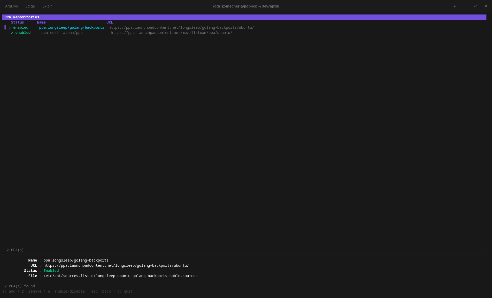
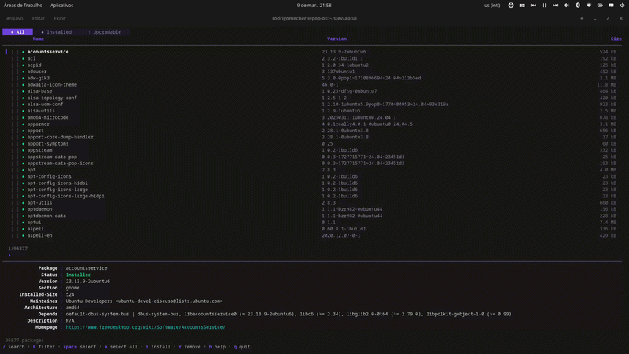

<p align= "center">  </p>

APTUI is a terminal user interface (TUI) written in Go for managing APT packages. Browse, search, install, remove and upgrade packages — all without leaving the terminal.

Built with [Bubble Tea](https://github.com/charmbracelet/bubbletea), [Lip Gloss](https://github.com/charmbracelet/lipgloss) and [Bubbles](https://github.com/charmbracelet/bubbles).


<table>
<tr>
  <td></td>
  <td></td>
</tr>
<tr>
  <td></td>
  <td></td>
</tr>
</table>


<table>
<tr>
  <td></td>
  <td></td>
</tr>
<tr>
  <td colspan="2" align="left"><em>Scrollable</em></td>
</tr>
</table>

## Features

- **Browse all packages** — lists every available APT package with version and size info loaded lazily
- **Search & filter** — single bar for fuzzy search and structured filters (section, architecture, size, status and more) ([docs](docs/filter.md))
- **Column sorting** — sort packages by name, version, size, section or architecture (ascending/descending)
- **Tabs** — switch between *All*, *Installed* and *Upgradable* views
- **Multi-select** — mark multiple packages with `space`, then bulk install/remove/upgrade
- **Mouse support** — click to select packages, click again to toggle selection, click column headers to sort
- **Parallel downloads** — installs and upgrades use parallel downloads by default for faster operations
- **Transaction history** — every operation is recorded; undo (`z`) or redo (`x`) past transactions
- **Fetch mirrors** — detect your distro, test mirror latency, and apply the fastest sources
- **PPA management** — list, add, remove, enable and disable PPA repositories ([docs](docs/ppa.md))
- **Cleanup** — dedicated tab listing autoremovable packages; clean them all with `c`
- **Error log** — all errors are captured and shown in a dedicated tab with source, timestamp and full message detail
- **Pin favorites** — pin packages with `F` to keep them at the top of the list (📌); pins are persisted across sessions
- **Export / Import** — export installed packages to a JSON file (`E`) and import from a file to restore your environment (`I`)
- **Inline detail panel** — shows package metadata (version, size, dependencies, homepage, etc.)

## Installation

### APT (Debian/Ubuntu)

```bash
curl -fsSL https://mexirica.github.io/aptui/public-key.gpg | sudo gpg --dearmor -o /usr/share/keyrings/aptui-archive-keyring.gpg
echo "deb [signed-by=/usr/share/keyrings/aptui-archive-keyring.gpg] https://mexirica.github.io/aptui/ stable main" | sudo tee /etc/apt/sources.list.d/aptui.list
sudo apt update && sudo apt install aptui
```

### Go

```bash
go install github.com/mexirica/aptui@latest
```

### Build from source

```bash
git clone https://github.com/mexirica/aptui.git
cd aptui
go build -o aptui .
sudo mv aptui /usr/local/bin/
```

## Usage

```bash
# Run with sudo to allow package management operations (install, remove, upgrade)
sudo aptui
```

## Keybindings

### Navigation

| Key | Action |
|---|---|
| `↑` / `k` | Move up |
| `↓` / `j` | Move down |
| `pgup` / `ctrl+u` | Page up |
| `pgdown` / `ctrl+d` | Page down |
| `tab` | Switch tab (All → Installed → Upgradable → Cleanup → Errors) |

### Search & Filter

| Key | Action |
|---|---|
| `/` | Open [search/filter](docs/filter.md) bar |
| `enter` | Confirm search / apply filter |
| `esc` | Clear search / filter / go back |

#### Examples

```
vim                          # fuzzy search for "vim"
section:editors vim          # filter by section + fuzzy search combined
installed size>10MB          # installed packages larger than 10 MB
section:utils order:name     # packages in "utils" section, sorted A→Z
order:size:desc              # all packages sorted by size, largest first
```

See the full [search & filter documentation](docs/filter.md) for all available options.

### Selection

| Key | Action |
|---|---|
| `space` | Toggle select current package |
| `A` | Select / deselect all filtered packages |
| `click` | Select a package (click again to toggle check) |

### Sorting

| Key / Mouse | Action |
|---|---|
| Click column header | Sort by that column (click again to reverse, third click to clear) |
| `/` + `order:name` | Sort by name via query |
| `/` + `order:size:desc` | Sort by size descending via query |

### Actions

| Key | Action |
|---|---|
| `i` | Install package (or all selected) |
| `r` | Remove package (or all selected) |
| `u` | Upgrade package (or all selected) |
| `G` | Upgrade all packages (`apt-get upgrade`) |
| `p` | Purge package (or all selected) |
| `c` | Clean up all autoremovable packages |
| `F` | Pin / unpin package (or all selected) |
| `E` | Export installed packages to JSON file |
| `I` | Import packages from JSON file |
| `U` | Run `apt-get update` |
| `ctrl+r` | Refresh package list |

### History & Mirrors

| Key | Action |
|---|---|
| `t` | Open transaction history |
| `z` | Undo selected transaction |
| `x` | Redo selected transaction |
| `f` | Fetch and test mirrors |

### PPA Management

| Key | Action |
|---|---|
| `P` | Open PPA list |
| `a` | Add a new PPA |
| `r` | Remove selected PPA |
| `e` | Enable / disable selected PPA |
| `esc` | Back to package list |

### General

| Key | Action |
|---|---|
| `h` | Toggle full help |
| `q` / `ctrl+c` | Quit |

---

<a href="https://www.star-history.com/?repos=mexirica%2Faptui&type=date&legend=top-left">
 <picture>
   <source media="(prefers-color-scheme: dark)" srcset="https://api.star-history.com/image?repos=mexirica/aptui&type=date&theme=dark&legend=top-left" />
   <source media="(prefers-color-scheme: light)" srcset="https://api.star-history.com/image?repos=mexirica/aptui&type=date&legend=top-left" />
   
 </picture>
</a>
